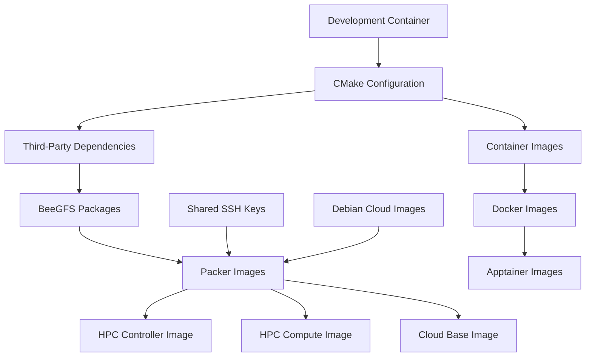

# Build System Architecture

**Status:** Production  
**Created:** 2025-01-20  
**Last Updated:** 2025-01-20

## Overview

The Hyperscaler project uses a sophisticated multi-layered build system that orchestrates containerized
development, infrastructure provisioning, and application deployment. The build system is designed around
CMake as the primary orchestrator, with Docker providing consistent development environments and Packer
handling infrastructure image creation.

## Build System Components

### 1. Development Container (Docker)

**Purpose:** Provides a consistent, isolated development environment with all required tools and dependencies.

**Key Features:**

- Based on Debian 13 "Trixie"
- Pre-installed development tools (CMake, Ninja, Packer, Terraform, Docker, Apptainer)
- Hardware acceleration support (KVM, libvirt)
- User permission mapping for seamless file access
- Container-in-container support for Docker builds

**Configuration:**

- **Dockerfile:** `docker/Dockerfile`
- **Image Name:** `pharos-dev:latest`
- **Helper Script:** `scripts/run-in-dev-container.sh`

### 2. CMake Build Orchestrator

**Purpose:** Central build system that coordinates all build targets and dependencies.

**Key Features:**

- Ninja generator for fast parallel builds
- Version compatibility checks for required tools
- Hierarchical target organization
- Dependency management across components

**Configuration:**:

- **Main CMakeLists.txt:** Root configuration
- **Build Directory:** `build/`
- **Generator:** Ninja (required)

### 3. Packer Infrastructure Images

**Purpose:** Creates virtual machine images for HPC infrastructure components.

**Components:**

- **[HPC Controller Image](../packer/hpc-controller/README.md):** SLURM controller with management tools
- **[HPC Compute Image](../packer/hpc-compute/README.md):** SLURM compute nodes with GPU support
- **[Cloud Base Image](../packer/cloud-base/README.md):** Generic cloud-ready base image

**Dependencies:**

- [BeeGFS packages](../3rd-party/beegfs/README.md) (built from source)
- Debian cloud images
- Shared SSH keys for provisioning

### 4. Container Images

**Purpose:** Application containers for HPC workloads and services.

**Documentation:** [Container Images README](../containers/README.md)

**Features:**

- Docker image building
- Apptainer conversion for HPC environments
- Automated testing and validation
- Multi-architecture support

### 5. Third-Party Dependencies

**Purpose:** Builds external dependencies from source.

**Components:**

- **[BeeGFS](../3rd-party/beegfs/README.md):** Parallel filesystem packages
- **[SLURM](../3rd-party/slurm/README.md):** Workload manager (future)

## Build Workflow

### 1. Development Environment Setup

```bash
# Build development container
make build-docker

# Configure CMake project
make config

# Enter interactive development environment
make shell-docker
```

### 2. Infrastructure Image Building

```bash
# Build all infrastructure images
make run-docker COMMAND="cmake --build build --target build-packer-images"

# Build specific image
make run-docker COMMAND="cmake --build build --target build-hpc-controller-image"
```

### 3. Container Image Building

```bash
# Build all container images
make run-docker COMMAND="cmake --build build --target build-all-containers"

# Build specific container
make run-docker COMMAND="cmake --build build --target build-container-<name>"
```

### 4. Third-Party Dependencies

```bash
# Build BeeGFS packages
make run-docker COMMAND="cmake --build build --target build-beegfs-packages"
```

## Build Dependencies

### Dependency Graph



### Build Order

1. **Development Container** - Build Docker image with all tools
2. **CMake Configuration** - Configure build system with Ninja
3. **Third-Party Dependencies** - Build BeeGFS packages from source
4. **Shared Resources** - Generate SSH keys and download base images
5. **Packer Images** - Build infrastructure VM images
6. **Container Images** - Build application containers
7. **Integration Testing** - Validate complete system

## Build Commands Reference

### High-Level Commands

For detailed build commands and component-specific documentation, refer to the individual component README files:

- **[Packer Images](../packer/README.md):** Infrastructure VM image building
- **[Container Images](../containers/README.md):** Application container building
- **[BeeGFS Packages](../3rd-party/beegfs/README.md):** Parallel filesystem packages
- **[SLURM Packages](../3rd-party/slurm/README.md):** Workload manager packages

### Quick Reference

#### Development Environment

```bash
make build-docker      # Build development Docker image
make shell-docker      # Start interactive shell in container
make config            # Configure CMake project with Ninja
```

#### Component Building

```bash
# Build all infrastructure images
make run-docker COMMAND="cmake --build build --target build-packer-images"

# Build all container images
make run-docker COMMAND="cmake --build build --target build-all-containers"

# Build third-party dependencies
make run-docker COMMAND="cmake --build build --target build-beegfs-packages"
```

#### Testing and Cleanup

```bash
# Run all tests
make run-docker COMMAND="cmake --build build --target test"

# Clean all resources
make run-docker COMMAND="cmake --build build --target cleanup"
```

## Build System Architecture

### Directory Structure

```text
pharos.ai-hyperscaler-on-workskation/
├── build/                          # CMake build directory
├── docker/                         # Development container
│   ├── Dockerfile
│   └── requirements.txt
├── scripts/                        # Build and utility scripts
│   └── run-in-dev-container.sh
├── packer/                         # Infrastructure images
│   ├── CMakeLists.txt
│   ├── hpc-controller/
│   ├── hpc-compute/
│   └── cloud-base/
├── containers/                     # Application containers
│   ├── CMakeLists.txt
│   └── images/
├── 3rd-party/                      # External dependencies
│   ├── CMakeLists.txt
│   ├── beegfs/
│   └── slurm/
├── CMakeLists.txt                  # Root CMake configuration
├── Makefile                        # Build automation
└── docs/                           # Documentation
    └── architecture/
        └── build-system.md
```

### Build Process Flow

1. **Container Build** - Development environment setup
2. **CMake Configuration** - Project configuration with Ninja
3. **Dependency Resolution** - Third-party package building
4. **Resource Preparation** - SSH keys, base images, cloud-init
5. **Image Building** - Packer VM images and Docker containers
6. **Conversion** - Docker to Apptainer conversion
7. **Testing** - Validation and integration testing
8. **Deployment** - Infrastructure provisioning (placeholder)

## Development Workflow

### Initial Setup

```bash
# Clone repository
git clone <repository-url>
cd pharos.ai-hyperscaler-on-workskation

# Build development container
make build-docker

# Configure build system
make config

# Enter development environment
make shell-docker
```

### Daily Development

```bash
# Start development session
make shell-docker

# Build specific components (see component READMEs for details)
make run-docker COMMAND="cmake --build build --target build-hpc-controller-image"
make run-docker COMMAND="cmake --build build --target build-container-<name>"

# Run tests
make run-docker COMMAND="cmake --build build --target test"
```

### Continuous Integration

```bash
# Full build pipeline
make build-docker
make config
make run-docker COMMAND="cmake --build build --target build-packer-images"
make run-docker COMMAND="cmake --build build --target build-all-containers"
make run-docker COMMAND="cmake --build build --target test"
```

For component-specific build commands and detailed workflows, refer to the individual component documentation:

- **[Packer Images](../packer/README.md):** Infrastructure image building workflows
- **[Container Images](../containers/README.md):** Container building and conversion workflows
- **[Third-Party Dependencies](../3rd-party/README.md):** External dependency building workflows

## Build Optimization

### Parallel Builds

- **Ninja Generator:** Enables parallel compilation
- **Multi-core BeeGFS Build:** Uses all available CPU cores
- **Docker Layer Caching:** Optimizes container builds
- **CMake Target Dependencies:** Ensures proper build order

### Caching Strategies

- **Docker Image Caching:** Reuses base layers
- **CMake Build Cache:** Preserves build artifacts
- **Packer Cache:** Reuses downloaded base images
- **Python Virtual Environment:** Caches installed packages

### Build Performance

- **Incremental Builds:** Only rebuild changed components
- **Dependency Tracking:** CMake tracks file dependencies
- **Parallel Execution:** Multiple targets build simultaneously
- **Resource Management:** Optimized for available system resources

## Troubleshooting

### Common Issues

#### Docker Container Issues

```bash
# Check if Docker is running
docker info

# Rebuild container if corrupted
make clean-docker
make build-docker

# Check container logs
docker logs <container-id>
```

#### CMake Configuration Issues

```bash
# Clean build directory
rm -rf build/
make config

# Check CMake version
cmake --version

# Verify Ninja installation
ninja --version
```

#### Packer Build Issues

```bash
# Validate Packer templates
cmake --build build --target validate-packer

# Check Packer version
packer version

# Clean Packer cache
rm -rf ~/.packer.d/
```

#### Container Build Issues

```bash
# Check Docker daemon
docker info

# Clean container artifacts
cmake --build build --target clean-all-containers

# Verify Apptainer installation
apptainer --version
```

### Debug Mode

```bash
# Enable verbose CMake output
cmake --build build --target <target> --verbose

# Enable Docker build logs
docker build --progress=plain -t pharos-dev:latest ./docker

# Enable Packer debug output
export PACKER_LOG=1
cmake --build build --target build-hpc-controller-image
```

## Integration Points

### With Development Tools

- **IDE Integration:** CMake provides project files for IDEs
- **Version Control:** Git hooks via pre-commit
- **Code Quality:** Automated linting and formatting
- **Documentation:** MkDocs integration for docs

## Conclusion

The Hyperscaler build system provides a robust, scalable foundation for developing and deploying HPC
infrastructure. By leveraging containerization, modern build tools, and automated workflows, it ensures
consistent, reproducible builds across different environments while maintaining high performance and
reliability.

The system's modular design allows for easy extension and customization, making it suitable for both
development and production use cases. Regular maintenance and updates ensure the build system remains
current with best practices and security requirements.
