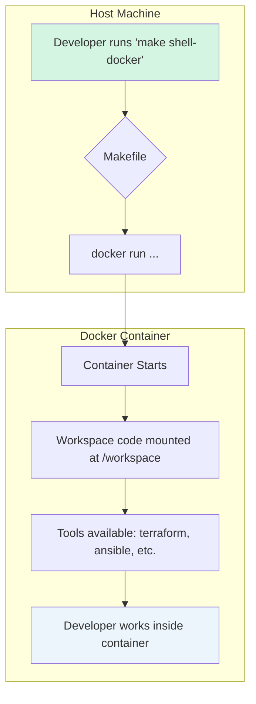

# Task 0.1 Implementation Plan: Development Docker Image

**Status**: Planning Phase
**Last Updated**: 2025-01-02
**Review Status**: Approved

---

## Overview

This document outlines the simplified implementation plan for **Task 0.1: Create Development Docker Image**.
The goal is to produce a streamlined, easy-to-use, and containerized development environment for the project.

## Objectives

- Create a reproducible, containerized development environment.
- Install all necessary infrastructure tools with pinned versions.
- Provide a simple, `make`-based workflow for all development tasks.
- Document the environment for new developers.

---

## Implementation Milestones

The implementation is broken down into three key, deliverable-focused milestones.

### **Milestone 1: Create the Core Development Image**

This milestone combines all Dockerfile-related tasks into a single deliverable. The goal is to produce a complete,
buildable `Dockerfile` that contains all necessary tools and dependencies for the project.

- **Deliverable**: `docker/Dockerfile`
- **Components**:
  - Base Image: Debian 12 "Bookworm"
  - System Packages: `git`, `build-essential`, `python3-pip`, `python3-venv`, etc.
  - Core Infrastructure Tools:
    - `terraform` (latest stable)
    - `packer` (latest stable)
    - `ansible` (latest stable)
    - `cmake` and `ninja-build`
  - Python Dependencies: Pinned in `docker/requirements.txt`
  - Non-root user setup for security.
- **Commit**: `feat(docker): create core development image with all tools`

### **Milestone 2: Automate the Development Workflow with a Makefile**

This milestone focuses on developer experience by consolidating all build, run, and management tasks into a single,
standardized interface.

- **Deliverable**: A root `Makefile`
- **Purpose**: To simplify and standardize all common development operations.
- **Makefile Targets**:
  - `make build-docker`: Build the Docker image.
  - `make shell-docker`: Launch an interactive shell inside the development container.
  - `make push-docker`: Push the built image to a container registry.
  - `make clean-docker`: Clean up build artifacts and stopped containers.
  - `make lint-docker`: Run linters and formatters.
- **Commit**: `feat(docker): add Makefile to automate dev environment workflow`

### **Milestone 3: Document the Environment**

The final milestone is to create clear, concise documentation for the new development environment, explaining
how to get started and use the `Makefile`-based workflow.

- **Deliverable**: `docker/README.md`
- **Content**:
  - **Prerequisites**: Docker installation.
  - **Quick Start**: How to use `make shell-docker` to begin developing.
  - **Makefile Targets**: A clear explanation of each `make` command.
  - **Development Workflow**: A summary of the intended workflow.
- **Commit**: `docs(docker): add documentation for the development environment`

---

## Proposed Development Workflow Diagram

This diagram illustrates the simplified workflow for a developer using the new environment.



---

## File Structure

```bash
├── Makefile                 # New: Automates all dev tasks
├── docker/
│   ├── Dockerfile           # The core development image definition
│   ├── requirements.txt     # Pinned Python dependencies
│   └── README.md            # New: Documentation for this environment
└── ... (rest of project)
```

---

## Next Steps

With this simplified plan, the next step is to proceed with **Milestone 1: Create the Core Development Image**.
