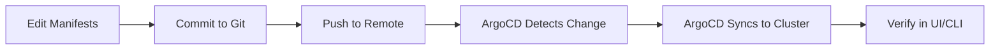

# GitOps Workflow Guide

**Status:** Complete - GitOps Migration
**Date:** 2025-10-31
**Tools:** ArgoCD, Kustomize, Ansible

## Overview

This guide describes the GitOps-based deployment workflow for the AI-HOW cloud cluster, using ArgoCD for continuous
delivery and Git as the single source of truth for Kubernetes resources.

## Architecture

```text
┌─────────────────────────────────────────────────────────────┐
│                    Git Repository (Source of Truth)          │
├─────────────────────────────────────────────────────────────┤
│  k8s-manifests/                                              │
│  ├── base/                  # Base configurations            │
│  │   └── mlops/                                              │
│  │       ├── minio/         # MinIO manifests                │
│  │       └── postgresql/    # PostgreSQL manifests           │
│  ├── overlays/              # Environment-specific           │
│  │   ├── dev/                                                │
│  │   └── prod/                                               │
│  └── argocd-apps/          # ArgoCD Application definitions  │
└─────────────────────────────────────────────────────────────┘
                          ↓
┌─────────────────────────────────────────────────────────────┐
│                      ArgoCD                                  │
├─────────────────────────────────────────────────────────────┤
│  • Monitors Git repository for changes                       │
│  • Compares desired state (Git) vs actual state (Cluster)   │
│  • Automatically syncs differences                           │
│  • Provides UI for visualization and management             │
└─────────────────────────────────────────────────────────────┘
                          ↓
┌─────────────────────────────────────────────────────────────┐
│                   Kubernetes Cluster                         │
├─────────────────────────────────────────────────────────────┤
│  Namespaces:                                                 │
│  • argocd     - ArgoCD components                           │
│  • mlops      - MLOps stack (MinIO, PostgreSQL, MLflow)    │
└─────────────────────────────────────────────────────────────┘
```

## Separation of Concerns

### Ansible: Infrastructure Layer

**Responsibility:** Provision and configure infrastructure

- VM provisioning and management
- Kubernetes cluster deployment (Kubespray)
- Base system configuration
- ArgoCD installation
- GPU drivers (bare metal/VMs)

**Commands:**

```bash
# Deploy complete cloud infrastructure (Kubernetes + ArgoCD)
ai-how cloud start config/cloud-cluster.yaml
make cloud-cluster-deploy

# Or deploy just Kubernetes using tags
ansible-playbook -i inventory.ini \
  ansible/playbooks/playbook-cloud-runtime.yml --tags kubespray

# Or deploy just ArgoCD using tags
ansible-playbook -i inventory.ini \
  ansible/playbooks/playbook-cloud-runtime.yml --tags argocd
```

### ArgoCD: Application Layer

**Responsibility:** Deploy and manage applications

- MLOps stack (MinIO, PostgreSQL, MLflow)
- GPU Operator
- KServe
- Monitoring stack
- Application configurations

**Commands:**

```bash
# Deploy applications via GitOps (part of cloud-cluster-deploy)
make cloud-cluster-deploy

# Or deploy just apps using tags
ansible-playbook -i inventory.ini \
  ansible/playbooks/playbook-cloud-runtime.yml --tags gitops-apps

# Or directly
kubectl apply -f k8s-manifests/argocd-apps/mlops-stack-app.yaml
```

## Setup

### Step 1: Deploy Infrastructure (Ansible)

```bash
# 1. Provision VMs and deploy Kubernetes with ArgoCD
ai-how cloud start config/cloud-cluster.yaml
make cloud-cluster-deploy

# 2. Verify cluster
kubectl get nodes

# 3. Verify ArgoCD installation
kubectl get pods -n argocd
```

### Step 2: Configure Git Repository

```bash
# 1. Initialize Git repository (if not already)
git init
git add .
git commit -m "Initial commit with GitOps manifests"

# 2. Push to remote (GitHub, GitLab, etc.)
git remote add origin https://github.com/your-org/ai-how.git
git push -u origin main

# 3. Update ArgoCD Application manifests with your Git URL
sed -i 's|https://github.com/your-org/ai-how|https://github.com/your-actual-org/ai-how|g' \
  k8s-manifests/argocd-apps/*.yaml

git add k8s-manifests/argocd-apps/
git commit -m "Update Git repository URLs"
git push
```

### Step 3: Deploy Applications (GitOps)

```bash
# Applications are deployed automatically by make cloud-cluster-deploy

# Or deploy just apps using tags
ANSIBLE_CONFIG=ansible/ansible.cfg ansible-playbook \
  -i output/cluster-state/inventory.yml \
  ansible/playbooks/playbook-cloud-runtime.yml \
  --tags gitops-apps

# Or manually
kubectl apply -f k8s-manifests/argocd-apps/mlops-stack-app.yaml
```

### Step 4: Verify Deployment

```bash
# Check ArgoCD applications
kubectl get applications -n argocd

# View in ArgoCD UI
kubectl port-forward svc/argocd-server -n argocd 8080:443
# Open https://localhost:8080

# Check deployed resources
kubectl get all -n mlops
```

## GitOps Workflow

### Daily Workflow



### Example: Update MinIO Storage Size

```bash
# 1. Edit manifest
vim k8s-manifests/base/mlops/minio/pvc.yaml
# Change: storage: 100Gi → storage: 200Gi

# 2. Commit and push
git add k8s-manifests/base/mlops/minio/pvc.yaml
git commit -m "Increase MinIO storage to 200Gi"
git push

# 3. ArgoCD automatically syncs (within ~3 minutes)
# Or manually trigger:
argocd app sync minio

# 4. Verify
kubectl get pvc -n mlops minio-storage
```

### Example: Add New Application

```bash
# 1. Create Kustomize manifests
mkdir -p k8s-manifests/base/mlops/mlflow
# Add deployment.yaml, service.yaml, etc.

# 2. Create Kustomization
cat > k8s-manifests/base/mlops/mlflow/kustomization.yaml <<EOF
apiVersion: kustomize.config.k8s.io/v1beta1
kind: Kustomization
namespace: mlops
resources:
  - deployment.yaml
  - service.yaml
EOF

# 3. Create ArgoCD Application
cat > k8s-manifests/argocd-apps/mlflow-app.yaml <<EOF
apiVersion: argoproj.io/v1alpha1
kind: Application
metadata:
  name: mlflow
  namespace: argocd
spec:
  project: default
  source:
    repoURL: https://github.com/your-org/ai-how
    targetRevision: HEAD
    path: k8s-manifests/base/mlops/mlflow
  destination:
    server: https://kubernetes.default.svc
    namespace: mlops
  syncPolicy:
    automated:
      prune: true
      selfHeal: true
EOF

# 4. Commit and push
git add k8s-manifests/
git commit -m "Add MLflow application"
git push

# 5. ArgoCD auto-deploys (App of Apps pattern handles this)
```

## ArgoCD UI

### Accessing the UI

```bash
# Port-forward
kubectl port-forward svc/argocd-server -n argocd 8080:443

# Get password
kubectl -n argocd get secret argocd-initial-admin-secret \
  -o jsonpath="{.data.password}" | base64 -d

# Open browser
open https://localhost:8080
# Username: admin
# Password: <from above>
```

### UI Features

- **Applications View:** Overview of all applications and their health
- **Resource Tree:** Visual representation of Kubernetes resources
- **Sync Status:** See what's in sync vs out of sync
- **Diff View:** Compare Git manifests with cluster state
- **Manual Sync:** Trigger syncs manually
- **Rollback:** Revert to previous Git commits

## ArgoCD CLI

### Installation

```bash
curl -sSL -o argocd-linux-amd64 \
  https://github.com/argoproj/argo-cd/releases/latest/download/argocd-linux-amd64
sudo install -m 555 argocd-linux-amd64 /usr/local/bin/argocd
rm argocd-linux-amd64
```

### Common Commands

```bash
# Login
argocd login localhost:8080 --username admin --password <password> --insecure

# List applications
argocd app list

# Get application details
argocd app get minio

# Sync application
argocd app sync minio

# View diff
argocd app diff minio

# View logs
argocd app logs minio

# Delete application
argocd app delete minio
```

## Environment Management

### Using Kustomize Overlays

```text
k8s-manifests/
├── base/
│   └── mlops/
│       └── minio/
│           ├── deployment.yaml
│           ├── service.yaml
│           └── kustomization.yaml
└── overlays/
    ├── dev/
    │   └── mlops/
    │       └── minio/
    │           ├── kustomization.yaml
    │           └── dev-patches.yaml
    └── prod/
        └── mlops/
            └── minio/
                ├── kustomization.yaml
                └── prod-patches.yaml
```

**Example Dev Overlay:**

```yaml
# overlays/dev/mlops/minio/kustomization.yaml
apiVersion: kustomize.config.k8s.io/v1beta1
kind: Kustomization

bases:
  - ../../../../base/mlops/minio

namespace: mlops-dev

patchesStrategicMerge:
  - dev-patches.yaml
```

**Example Dev Patch:**

```yaml
# overlays/dev/mlops/minio/dev-patches.yaml
apiVersion: apps/v1
kind: Deployment
metadata:
  name: minio
spec:
  replicas: 1
  template:
    spec:
      containers:
        - name: minio
          resources:
            requests:
              cpu: "250m"
              memory: "512Mi"
```

**Deploy Dev Environment:**

```yaml
# k8s-manifests/argocd-apps/dev-minio-app.yaml
apiVersion: argoproj.io/v1alpha1
kind: Application
metadata:
  name: minio-dev
  namespace: argocd
spec:
  project: default
  source:
    repoURL: https://github.com/your-org/ai-how
    targetRevision: dev
    path: k8s-manifests/overlays/dev/mlops/minio
  destination:
    server: https://kubernetes.default.svc
    namespace: mlops-dev
  syncPolicy:
    automated:
      prune: true
      selfHeal: true
```

## Secrets Management

### Option 1: Sealed Secrets (Recommended for Production)

```bash
# Install Sealed Secrets controller
kubectl apply -f https://github.com/bitnami-labs/sealed-secrets/releases/download/v0.24.0/controller.yaml

# Install kubeseal CLI
wget https://github.com/bitnami-labs/sealed-secrets/releases/download/v0.24.0/kubeseal-0.24.0-linux-amd64.tar.gz
tar xfz kubeseal-0.24.0-linux-amd64.tar.gz
sudo install -m 755 kubeseal /usr/local/bin/kubeseal

# Create sealed secret
kubectl create secret generic minio-credentials \
  --from-literal=accesskey=admin \
  --from-literal=secretkey=SecurePassword123! \
  --dry-run=client -o yaml | \
  kubeseal -o yaml > k8s-manifests/base/mlops/minio/sealed-secret.yaml

# Commit sealed secret (safe to commit to Git)
git add k8s-manifests/base/mlops/minio/sealed-secret.yaml
git commit -m "Add MinIO sealed secret"
git push
```

### Option 2: External Secrets Operator

```bash
# Install External Secrets Operator
helm repo add external-secrets https://charts.external-secrets.io
helm install external-secrets external-secrets/external-secrets -n external-secrets-system --create-namespace

# Configure secret store (e.g., AWS Secrets Manager, Vault)
# Create ExternalSecret resource
# ArgoCD manages the ExternalSecret, which creates the actual Secret
```

### Option 3: SOPS (for simple use cases)

```bash
# Install SOPS
wget https://github.com/mozilla/sops/releases/download/v3.8.1/sops-v3.8.1.linux.amd64
sudo mv sops-v3.8.1.linux.amd64 /usr/local/bin/sops
sudo chmod +x /usr/local/bin/sops

# Encrypt secret
sops --encrypt --age <public-key> \
  k8s-manifests/base/mlops/minio/secret.yaml > \
  k8s-manifests/base/mlops/minio/secret.enc.yaml

# Commit encrypted secret
git add k8s-manifests/base/mlops/minio/secret.enc.yaml
git commit -m "Add encrypted MinIO secret"
git push

# ArgoCD with SOPS plugin will decrypt during deployment
```

## Troubleshooting

### Application OutOfSync

**Symptom:** Application shows as "OutOfSync" in ArgoCD UI

**Solution:**

```bash
# View diff
argocd app diff minio

# Manual sync
argocd app sync minio

# Force sync (if needed)
argocd app sync minio --force

# Check for manual changes in cluster
kubectl get deployment minio -n mlops -o yaml
```

### Application Degraded/Unhealthy

**Symptom:** Application health shows as "Degraded" or "Unknown"

**Solution:**

```bash
# Check pods
kubectl get pods -n mlops -l app=minio

# Check events
kubectl get events -n mlops --sort-by='.lastTimestamp'

# View ArgoCD logs
kubectl logs -n argocd deployment/argocd-application-controller

# Check application details
argocd app get minio
```

### Sync Failed

**Symptom:** Sync operation fails

**Solution:**

```bash
# View sync status
argocd app get minio

# Check resource errors
kubectl describe application minio -n argocd

# Try manual sync with options
argocd app sync minio --prune --force --replace
```

## Best Practices

### 1. Git Workflow

- **Main branch:** Production deployments
- **Dev branch:** Development deployments
- **Feature branches:** Testing new features
- **Pull requests:** Review all changes before merging

### 2. Manifest Organization

- **Base manifests:** Common configuration
- **Overlays:** Environment-specific patches
- **DRY principle:** Don't repeat yourself
- **Clear naming:** Use descriptive names

### 3. Security

- **Never commit plain secrets:** Use Sealed Secrets or External Secrets
- **Use RBAC:** Limit who can sync applications
- **Enable SSO:** Integrate with identity providers
- **Audit logs:** Review ArgoCD audit logs regularly

### 4. Monitoring

- **Watch sync status:** Set up alerts for sync failures
- **Monitor health:** Track application health status
- **Resource usage:** Monitor deployed resources
- **Git activity:** Track who changes what

## Migration from Ansible

### Phase 1: Both Approaches (Current State)

- Ansible playbooks still available
- ArgoCD installed via Ansible
- Applications can be deployed either way

### Phase 2: Gradual Migration

- New applications deployed via GitOps only
- Existing applications remain on Ansible temporarily
- Team learns GitOps workflow

### Phase 3: Full GitOps (Future State)

- All applications managed by ArgoCD
- Ansible only for infrastructure
- Git as single source of truth

## References

- **ArgoCD Documentation:** https://argo-cd.readthedocs.io/
- **Kustomize Documentation:** https://kustomize.io/
- **GitOps Principles:** https://opengitops.dev/
- **Sealed Secrets:** https://github.com/bitnami-labs/sealed-secrets
- **ArgoCD Best Practices:** https://argo-cd.readthedocs.io/en/stable/user-guide/best_practices/

## Summary

✅ **Infrastructure:** Managed by Ansible (VMs, Kubernetes, ArgoCD)
✅ **Applications:** Managed by ArgoCD (MinIO, PostgreSQL, MLflow, etc.)
✅ **Source of Truth:** Git repository
✅ **Continuous Delivery:** Automatic sync from Git to cluster
✅ **Separation of Concerns:** Clear boundaries between infra and apps

**Next Steps:**

1. Deploy complete cloud runtime: `make cloud-cluster-deploy`
2. Configure Git repository URLs
3. Start using GitOps workflow for all application changes
4. Use tags for selective deployment (e.g., `--tags argocd` or `--tags gitops-apps`)
